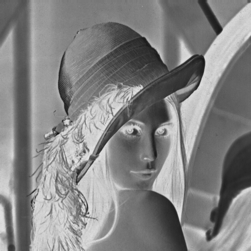
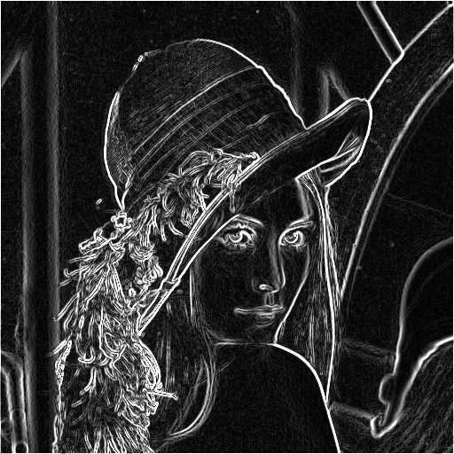
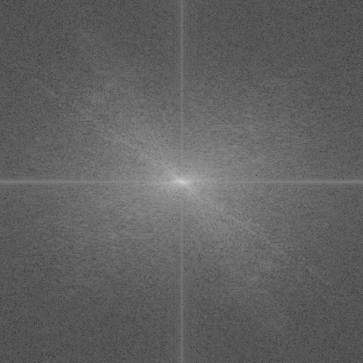
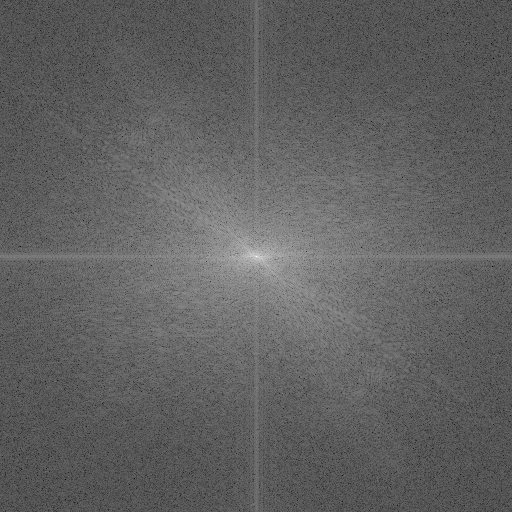
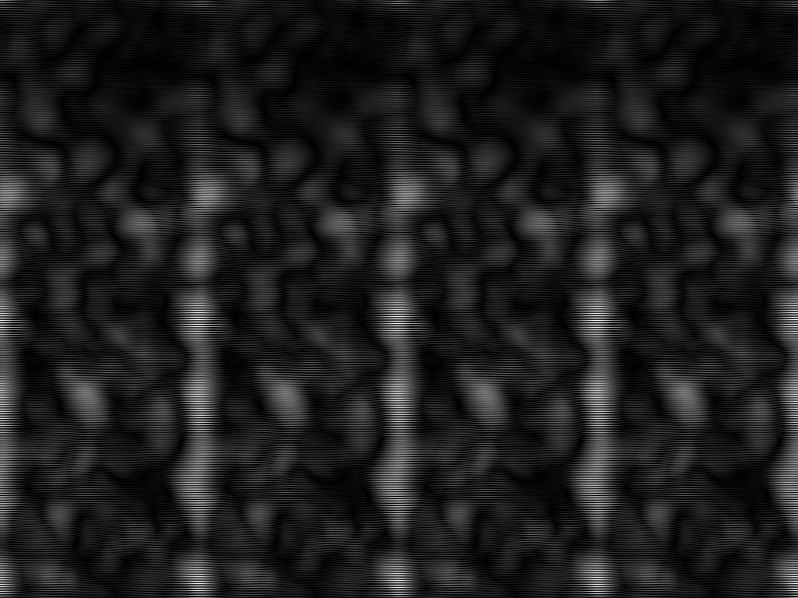

# Piciem: Image Processing Library in C

[](License)
[](https://en.wikipedia.org/wiki/C99)
[](https://github.com/uzunenes/piciem/issues)

> **Open for Contributions!** We welcome pull requests, bug reports, and feature suggestions. See [Contributing](#contributing) section.

**Piciem** is a lightweight image processing library in C. Built for education and basic image manipulation. Uses only the C standard library - no external dependencies.

Perfect for learning image processing concepts and C programming fundamentals.

## Features

- **Zero Dependencies**: Only C standard library
- **Educational**: Clear, documented implementations with formulas
- **Portable**: Works on any platform with a C compiler
- **Complete**: From basic operations to FFT frequency domain processing

## Visual Examples

### Original Image
<p align="center">
  
  <br><em>Test image: Lena 512x512</em>
</p>

### Basic Operations

| Brightness (+50) | Contrast (×1.5) | Invert (Negative) |
|:---:|:---:|:---:|
|  |  |  |
| `out = in + 50` | `out = (in-128)×1.5 + 128` | `out = 255 - in` |

### Thresholding

| Simple Threshold (t=128) | Otsu Automatic |
|:---:|:---:|
|  |  |
| Fixed threshold value | Maximizes between-class variance |

### Enhancement & Edge Detection

| Histogram Equalization | Sobel Edge Detection |
|:---:|:---:|
|  |  |
| Improves contrast distribution | `G = √(Gx² + Gy²)` |

### Frequency Domain

| DFT Magnitude Spectrum | FFT Magnitude Spectrum |
|:---:|:---:|
|  |  |
| O(n²) - 4.39 seconds | O(n log n) - 0.02 seconds |

> **Performance**: FFT is ~200× faster than DFT for 512×512 images!

### Homomorphic Filtering

| Input (Poor Lighting) | Output (Enhanced) |
|:---:|:---:|
|  |  |
| Uneven illumination | Balanced lighting |

## Available Functions

### Image I/O
| Function | Description |
|----------|-------------|
| `lpgm_file_read()` | Read PGM files (P2 ASCII, P5 binary) |
| `lpgm_file_write()` | Write PGM files |

### Basic Operations
| Function | Formula | Description |
|----------|---------|-------------|
| `lpgm_brightness()` | `out = in + δ` | Adjust brightness |
| `lpgm_contrast()` | `out = (in-128)×α + 128` | Adjust contrast |
| `lpgm_invert()` | `out = 255 - in` | Create negative |
| `lpgm_threshold()` | `out = (in > t) ? 255 : 0` | Binary threshold |
| `lpgm_otsu_threshold()` | Maximize σ²_B | Automatic threshold |

### Enhancement & Detection
| Function | Description |
|----------|-------------|
| `lpgm_histogram_equalization()` | Improve contrast via CDF |
| `lpgm_sobel()` | Edge detection with Sobel operator |

### Frequency Domain
| Function | Complexity | Description |
|----------|------------|-------------|
| `lpgm_dft()` / `lpgm_dft2()` | O(n²) | Discrete Fourier Transform |
| `lpgm_fft()` / `lpgm_fft2()` | O(n log n) | Fast Fourier Transform (Cooley-Tukey) |

## Quick Start

### Build & Install

```bash
git clone https://github.com/uzunenes/piciem.git
cd piciem
make
sudo make install
```

### Run an Example

```bash
cd examples/edge_detection
make
./sobel.out ../pgm_io/lena_ascii.pgm
```

## Project Structure

```
piciem/
├── include/pigiem.h        # Public API header
├── src/
│   ├── pgm_io.c            # PGM file I/O
│   ├── image.c             # Image processing
│   ├── dft.c               # DFT implementation
│   ├── fft.c               # FFT (Cooley-Tukey)
│   └── utils.c             # Utilities
├── examples/
│   ├── basic_operations/   # Brightness, contrast, invert
│   ├── thresholding/       # Simple & Otsu threshold
│   ├── histogram/          # Histogram equalization
│   ├── edge_detection/     # Sobel operator
│   ├── frequency_domain/   # DFT & FFT examples
│   └── homomorphic_filtering/
├── docs/images/            # Example output images
└── Makefile
```

## Code Example

```c
#include <pigiem.h>

int main(void)
{
    lpgm_t pgm;
    lpgm_image_t edges;
    
    // Read image
    lpgm_file_read("input.pgm", &pgm);
    
    // Apply Sobel edge detection
    edges = lpgm_sobel(&pgm.im);
    
    // Save result
    pgm.im = edges;
    lpgm_file_write(&pgm, "output.pgm");
    
    // Cleanup
    lpgm_image_destroy(&edges);
    lpgm_file_destroy(&pgm);
    
    return 0;
}
```

Compile with:
```bash
gcc -o example example.c -lpigiem -lm
```

## Performance

Tested on 512×512 Lena image:

| Operation | Time |
|-----------|------|
| DFT (2D) | 4.39 s |
| FFT (2D) | 0.02 s |
| Sobel | < 0.01 s |
| Histogram Eq. | < 0.01 s |
| Otsu Threshold | < 0.01 s |

## Contributing

Contributions are welcome! Here's how you can help:

1. **Report Bugs**: Open an issue describing the bug
2. **Suggest Features**: Open an issue with your idea
3. **Submit PRs**: Fork, make changes, submit pull request

### Development

```bash
# Build with debug symbols
make DEBUG=1

# Run an example
cd examples/basic_operations
make
./brightness_contrast.out ../pgm_io/lena_ascii.pgm
```

## License

MIT License - See [License](License) file.

