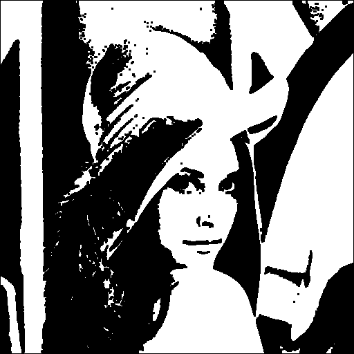
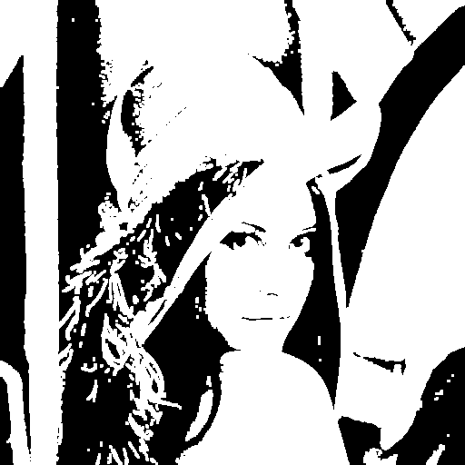
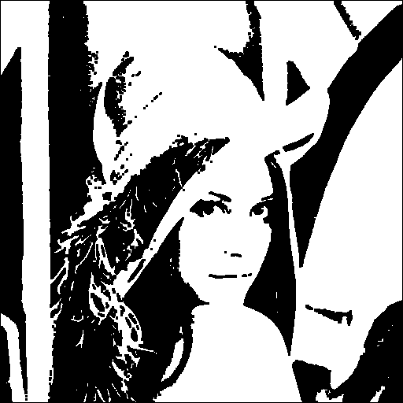

# Piciem

Image processing library in C. No external dependencies, only standard library.

## Examples

### Original
<p align="center">
  
</p>

### Basic Operations

| Brightness (+50) | Contrast (×1.5) | Invert |
|:---:|:---:|:---:|
|  |  |  |

### Thresholding

| Simple (t=128) | Otsu |
|:---:|:---:|
|  |  |

### Enhancement & Edge Detection

| Histogram Equalization | Sobel |
|:---:|:---:|
|  |  |

### Frequency Domain

| DFT (4.39s) | FFT (0.02s) |
|:---:|:---:|
|  |  |

### Homomorphic Filtering

| Input | Output |
|:---:|:---:|
|  |  |

### Filters & Noise

| Original | Gaussian Blur | Noisy (5%) | Median Denoised |
|:---:|:---:|:---:|:---:|
|  |  |  |  |

### Frequency Filters

| Original | Low Pass (Butterworth) |
|:---:|:---:|
|  |  |

### Morphology

| Binary | Eroded | Dilated |
|:---:|:---:|:---:|
|  |  |  |

| Opening | Closing |
|:---:|:---:|
|  |  |

## Functions

### I/O
- `lpgm_file_read()` - Read PGM (P2/P5)
- `lpgm_file_write()` - Write PGM

### Basic
- `lpgm_brightness()` - `out = in + δ`
- `lpgm_contrast()` - `out = (in-128)×α + 128`
- `lpgm_invert()` - `out = 255 - in`
- `lpgm_threshold()` - Binary threshold
- `lpgm_otsu_threshold()` - Automatic threshold

### Filters
- `lpgm_convolve()` - NxN kernel convolution
- `lpgm_median_filter()` - Median filter
- `lpgm_add_salt_pepper_noise()` - Add noise
- `lpgm_gamma()` - Gamma correction

### Enhancement
- `lpgm_histogram_equalization()` - Histogram equalization
- `lpgm_sobel()` - Edge detection

### Frequency Domain
- `lpgm_dft()` / `lpgm_dft2()` - DFT, O(n²)
- `lpgm_fft()` / `lpgm_fft2()` - FFT, O(n log n)
- `lpgm_filter_ideal_lowpass/highpass()` - Ideal filter
- `lpgm_filter_butterworth_lowpass/highpass()` - Butterworth filter
- `lpgm_filter_gaussian_lowpass/highpass()` - Gaussian filter

### Morphology
- `lpgm_erode()` - Erosion
- `lpgm_dilate()` - Dilation
- `lpgm_opening()` - Opening (erosion + dilation)
- `lpgm_closing()` - Closing (dilation + erosion)

## Build

```bash
git clone https://github.com/uzunenes/piciem.git
cd piciem
make
sudo make install
```

## Usage

```bash
cd examples/edge_detection
make
./sobel.out ../pgm_io/lena_ascii.pgm
```

## Structure

```
piciem/
├── include/pigiem.h
├── src/
│   ├── pgm_io.c
│   ├── image.c
│   ├── dft.c
│   ├── fft.c
│   └── utils.c
├── examples/
│   ├── basic_operations/
│   ├── thresholding/
│   ├── filters/
│   ├── noise/
│   ├── histogram/
│   ├── edge_detection/
│   ├── frequency_domain/
│   ├── frequency_filters/
│   ├── morphology/
│   └── homomorphic_filtering/
└── docs/images/
```

## Example Code

```c
#include <pigiem.h>

int main(void)
{
    lpgm_t pgm;
    lpgm_image_t edges;
    
    lpgm_file_read("input.pgm", &pgm);
    edges = lpgm_sobel(&pgm.im);
    
    pgm.im = edges;
    lpgm_file_write(&pgm, "output.pgm");
    
    lpgm_image_destroy(&edges);
    lpgm_file_destroy(&pgm);
    return 0;
}
```

```bash
gcc -o example example.c -lpigiem -lm
```

## License

MIT

